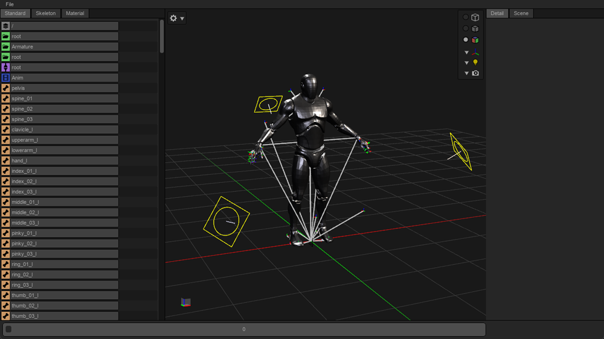

# USD Asset Viewer
- A python/C++ tool for navigating USD (Universal Scene Description) scene hierarchies.

## Status
- WIP

## Screenshot

## Features
- Hydra viewport
- Outliner panel
- Details panel
- Trackbar panel

## Dependencies
#### Python
- OpenUSD
- imgui_bundle
- toml
#### C++
- OpenUSD
- imgui

## Usage
- File > Open USD > *.usd

## License
- MIT License
