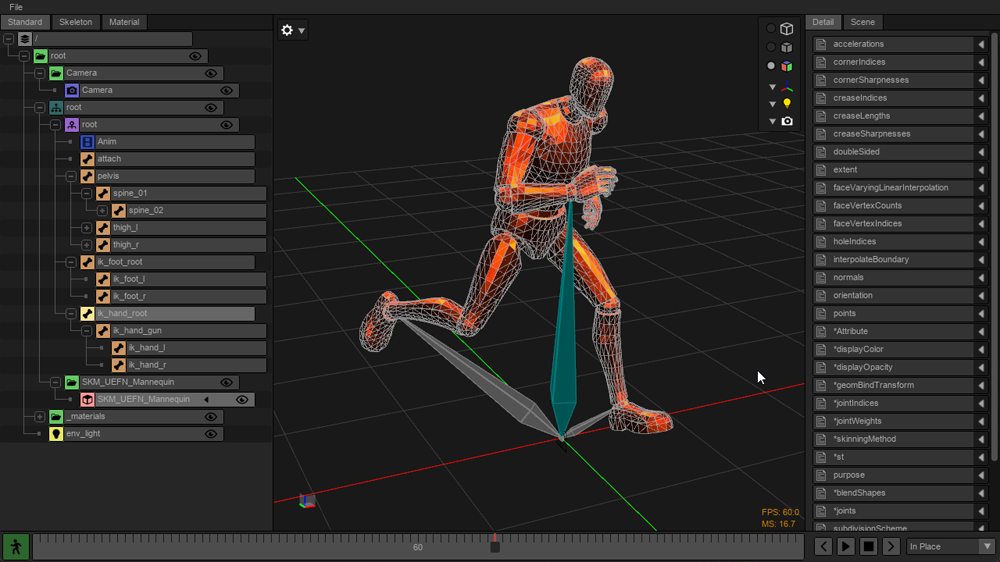

# USD Asset Viewer
- A python/C++ tool for navigating USD (Universal Scene Description) scene hierarchies.

## Status
- 1 Month Project
- Day 30/31
- WORK IN PROGRESS

## Current Screenshot

## Features

### Core (1 Month Project)
- Hydra viewport
    - Default camera
    - Default lighting
    - View modes:
        - Wireframe
        - Shaded with wireframe
        - Full shading
    - OGL visualization for non-geometry objects:
        - Grid
        - Orientation gizmo
        - Camera
        - XForm
        - Lights
        - Bone (solid and xray)
- Outliner panel:
    - Standard view
- Details panel:
    - Attributes
- Trackbar panel:
    - Animation Modes:
        - In place
        - Root motion

### Future
- Animation node editor:
    - Add
    - Subtract
    - Mask
- Material editor:
    - Add
    - Subtract
    - Multiply
    - Mask

## Installation
#### Compatibility:
- Windows (Tested)
- Linux (Tested)
- Mac (WIP)
#### Requirments:
- git
- Python >=3.10
- C ++ Compiler
    - Windows: VS 2019+ (OpenUSD)

#### Steps:
0) Open terminal or powershell.
1) `git clone https://github.com/back-slash/usd_asset_viewer.git`
2) `cd usd_asset_viewer`
3) Windows: `python build_run.py` Linux: `python3 build_run.py`
4) Allow build script to install all dependencies. This can take a long time due to building OpenUSD.
5) Once building is complete USD Asset Viewer will open.
6) Future runs can be done using step 3.

## Usage
- File > Open USD > *.usd

## License
- MIT License
